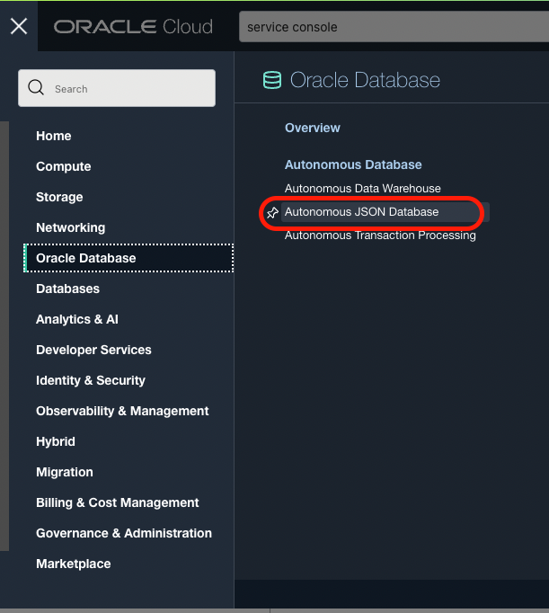
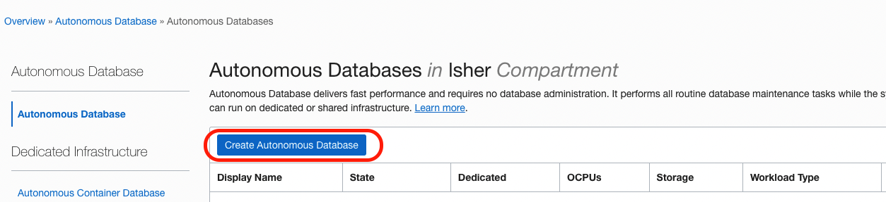
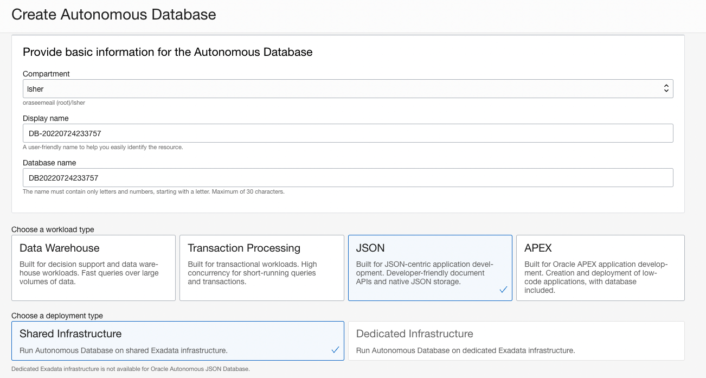
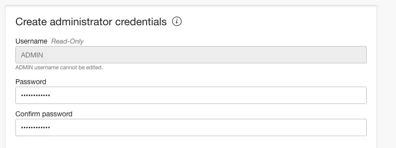
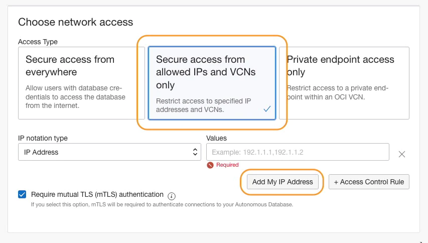
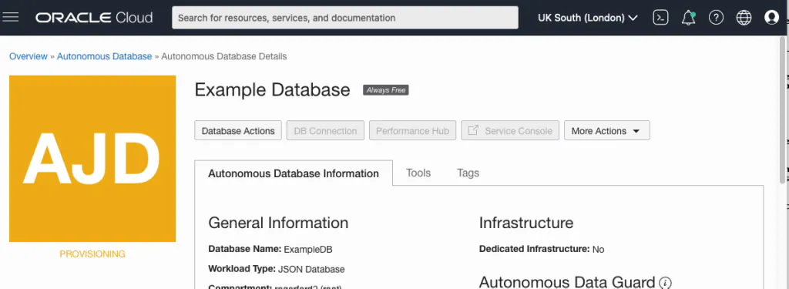
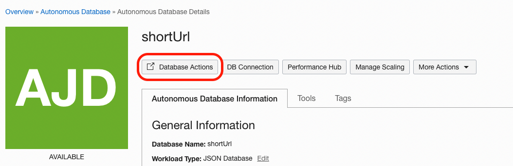
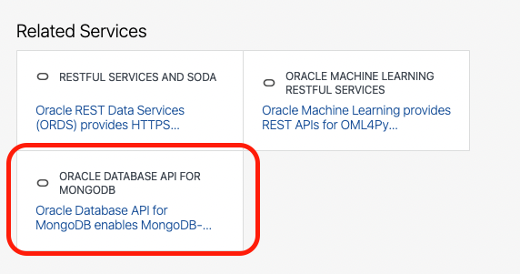
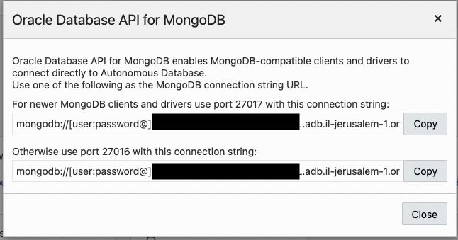

# URL Shortener 🔗
A simple web application built with Node.js, Express, and Oracle Database API for MongoDB
(based on https://github.com/smallpaes/url-shortener)

___

## Project First Look


## User Stories
1. User can input a set of URL aiming to be shortened
2. User can get a warning message for invalid URL format input
3. User can get a set of shortened URL from the original URL provided
4. User can copy the shortened URL to clipboard by clicking the copy button
5. User can reset the input columns for next URL generation 
6. User can be redirected to the original URL by visiting the shortened URL

___

## Getting Started with Autonomous JSON Database and the API for MongoDB

This quick-start guide steps you through the stages needed to get started with the Oracle Database API for MongoDB. The full documentation is available at the locations below -

[Autonomous Database chapter about configuring Database API for MongoDB](https://docs.oracle.com/en/cloud/paas/autonomous-database/adbsa/mongo-using-oracle-database-api-mongodb.html#GUID-8321D7A6-9DBD-44F8-8C16-1B1FBE66AC56)

[Documentation for Oracle Database API for MongoDB](https://docs.oracle.com/en/database/oracle/mongodb-api/mgapi/index.html)

First, if you don't have one already, you will need to sign up for an Oracle Cloud account. You can use an Always-Free account, and nothing will ever be charged to your credit card unless you explicitly upgrade your account to a paid account. Full details on getting signed up for an Oracle Cloud account and getting Autonomous JSON Database for free can be found [here](https://www.oracle.com/autonomous-database/free-trial/).

When we're signed up, we will need to create an Autonomous JSON Database, or AJD (you can also use the Database API for MongoDB with other Autonomous Database workloads, but we'll stick with AJD here).

Once signed into Oracle Cloud, you'll use the "Hamburger Menu" in the top left to choose Oracle Database, then Autonomous JSON Database:



Now click on Create Autonomous Database



Provide a Display name and Database Name (or leave them at the generated defaults). Leave workload type set to JSON and deployment type as Shared Infrastructure.



Scroll down to "Create administrator credentials", and enter and confirm a password for the ADMIN user. Don't forget this password!



## **** The next part is important. ****
The Database API for MongoDB will only be available if you define "Secure access from allowed Ips and VCNs only". Click that option (it is not the default):


If you will just want to connect from your current machine, use the "Add My IP Address" button. If you will want to connect from other machines (such as an Oracle Cloud VM) you can enter the addresses of those as well.

Hint: If you’re not sure what compute instances you will want to connect from, you can change the IP notation type field to CIDR block, and enter a value of 0.0.0.0/0. That will allow you to connect from anywhere, but naturally you should only use that for testing.

When done, click “Create Autonomous Database” at the bottom of the screen. You will see an orange AJD logo with PROVISIONING underneath.



You can now go to the "Database Actions" (if it doesn't load immediately, wait a couple of seconds and try again)



In the new tab, scroll down to "Related Services" and locate the box named "ORACLE DATABASE API FOR MONGODB" and click on it



Don't see that? Most likely you didn't define "Secure Access from allowed IPs" for your database. If the database is set up for "Secure Access from anywhere" then this card will not be shown

Click on it, a new pop-up will be shown:



Port 27017 should work for most newer clients and tools, but if you have problems it may be worth trying the port 27016 URL instead.

Copy the first URL using the Copy button, and save it somewhere for later use.

The URL has the format:


```
mongodb://[user:password@]autonomousDatabaseAddress:27017/[user]?authMechanism=PLAIN&authSource=$external&ssl=true&retryWrites=false&loadBalanced=true
```

replace `user` with `admin` (both places!)

replace `password` with the password created during the creation of the db

keep the modifiy connection string to be used later.


## Installation
The following instructions will get you a copy of the project and all the setting needed to run it on your local machine and Oracle Database API for MongoDB.


### Prerequisites

- [npm](https://www.npmjs.com/get-npm)
- [Node.js v16 and up](https://nodejs.org/en/download/)
- [Yarn](https://yarnpkg.com/) (`npm install -g yarn`)


### Clone

Clone this repository to your local machine

```
$ git clone https://github.com/lironsher/oci-url-shortener.git
```


### Setup

**1. Enter the project folder**

```
$ cd oci-url-shortener
```

**2. Install npm packages**

```
$ yarn 
```

**3. create env file**
rename the file named `.env.sample` to `.env` (or create new `.env`)


**4. update the connection string**
set `MONGODB_URI` with the connection string created before and save the file
(update the port if needed)


**5. Activate the server**

```
$ yarn start dev
```
or 

```
$ node app.js
```

**4. Find the message for successful activation**

```
> App is running open: https://localhost:80
> mongodb connected!
```
You may visit the application on browser with the URL: http://localhost:80

___


## FAQ
- **Can I try this app online?**
    - Yes, kindly visit [http://short.xccv.co/](http://short.xccv.co/)


___

## Orignal Authors
Node code - [Mike Huang](https://github.com/smallpaes)

OCI - [Roger Ford](https://blogs.oracle.com/database/post/mongodb-api)

## OCI Version Author
[Liron Sher](https://github.com/lironsher)

### Trial in this project 🤠
**To increase user experience**
+ [Animate.css](https://daneden.github.io/animate.css/) is used to show animation for certain actions
